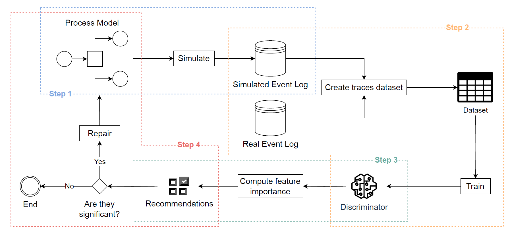

# Repairing Process Models through Simulation and Explainable AI

<b>A Framework for repairing Petri Net Process models using Process Simulation and Explainable AI.</b>

<i>A process model is one of the main milestones for Business Process Management and Mining. They are used to engage process stakeholders into discussions on how processes should be executed, or are alternatively used as input for Process-aware Information Systems to automate processes. Desirable models need to be precise and only allow legitimate behavior (high precision), while enabling the executions that have been observed (high fitness). Often, models fail to achieve these properties, and need to be repaired. This paper proposes a model-repair framework that compares the behavior allowed by the model with what observed in reality, aiming to pinpoint the distinguishing features. The framework creates a Machine Learning model that discriminates the traces of the real event log w.r.t. those of a synthetic event log obtained via simulation of the process model. Explainable-AI techniques are employed to make the distinguishing features explicit, which are then used to repair the original process model.
Our framework has been implemented and evaluated on four processes and various models, proving the effectiveness of enhancing the original process model achieving a balanced trade-off between fitness and precision. Our results are then compared with those obtained through the state of the art, which tend to prefer fitness over precision: the comparison shows that our framework outperforms the literature in balancing fitness and precision.</i>

To  view results: Download <a href="MLProcessModelRepair.ipynb" download>MLProcessModelRepair.ipynb</a></code> and Upload it to Google Colab<a href="https://colab.research.google.com" target="_blank"></a>.

<div style="text-align:center">
  
</div>

### How to use:

<ol>
    <li>
        <strong>Clone this repository.</strong>
    </li>
    <li>
        <strong>Clone <code><a href="https://anonymous.4open.science/r/SPN_Simulator-3B2F" target="_blank">SPN_Simulator</a></code> into <code>MLProcessModelRepair</code></strong>
    </li>
    <li>
        <strong>Navigate into the <code>MLProcessModelRepair</code> directory:</strong>
        <pre><code>$ cd MLProcessModelRepair</code></pre>
    </li>
    <li>
        <strong>Create environment using conda:</strong>
        <pre><code>$ conda create --name ENVNAME --file requirements.txt</code></pre>
    </li>
</ol>

```python
import repair_pn
import pm4py

model_path = 'data/Purchasing/diagram_0.pnml'
log_path = 'data/Purchasing/log.xes'

repaired_net, im, fm, _ = repair_pn.apply(log_path, model_path, greedy_method=True)

# show the repaired Petri net
pm4py.view_petri_net(repaired_net, im, fm)
```

### Experiments Replicability Instructions:

Input and output files are in <a href="data.zip"><code>data.zip</code></a>.
#### To view results:
<ol>
    <li>
        <strong>Download <a href="MLProcessModelRepair.ipynb" download>MLProcessModelRepair.ipynb</a></code> and Upload it to Google Colab <a href="https://colab.research.google.com" target="_blank"></a></strong>
    </li>
    <li>
        <strong>Upload <code>data.zip</code>.</strong>
    </li>
    <li>
        <strong>Unzip <code>data.zip</code>:</strong>
        <pre><code>!unzip data.zip</code></pre>
    </li>
    <li>
        <strong>Launch notebook cells following instructions in the comments.</strong>
    </li>
</ol>

#### To re-launch experiments:
<ol>
    <li>
        <strong>Clone this repository.</strong>
    </li>
    <li>
        <strong>Clone <code><a href="https://github.com/franvinci/SPN_Simulator" target="_blank">SPN_Simulator</a></code> into <code>MLProcessModelRepair</code></strong>
    </li>
    <li>
        <strong>Create environment using conda:</strong>
        <pre><code>$ conda create --name ENVNAME --file requirements.txt</code></pre>
    </li>
    <li>
        <strong>Unzip <code>data.zip</code>:</strong>
        <pre><code>$ unzip data.zip</code></pre>
    </li>
    <li><ol>
        <li>
            <strong>Run a specific experiment (e.g. <code>Purchasing</code>):</strong>
            <pre><code>$ python run.py --case_study 'Purchasing'</code></pre>
        </li>
        <li>
            <strong>Run all experiments:</strong>
            <pre><code>$ python run_experiments.py</code></pre>
        </li>
        </ol>
    </li>
</ol>
