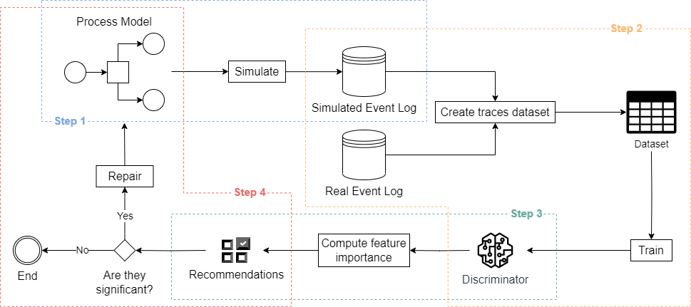

# Repairing Process Models through Simulation and Explainable AI

<b>A Framework for repairing Petri Net Process models using Process Simulation and Explainable AI.</b>

<i>A process model is one of the main milestones for Business Process Management and Mining. They are used to engage process stakeholders into discussions on how processes should be executed, or are alternatively used as input for Process-aware Information Systems to automate processes. Desirable models need to be precise and only allow legitimate behavior (high precision), while enabling the executions that have been observed (high fitness). Often, models fail to achieve these properties, and need to be repaired. This paper proposes a model-repair framework that compares the behavior allowed by the model with what observed in reality, aiming to pinpoint the distinguishing features. The framework creates a ML model that discriminates the traces of the real event log wrt. those of a synthetic event log obtained via simulation of the process model. Explainable-AI techniques are employed to make the distinguish features explicit, which are then used to repair the original process model. 
Our framework has been implemented and evaluated on four processes and various models, proving the effectiveness of enhancing the original process model achieving a balanced trade-off between fitness and precision. Our results are then compared with those obtained through the state of the art, which tends to prefer fitness over precision: the comparison shows that our framework outperforms the literature in balancing fitness and precision.</i>

  

### Replicability Instructions:

<ol>
    <li>
        <strong>Clone the Repository:</strong>
        <pre><code>git clone https://github.com/franvinci/SPN_Simulator</code></pre>
    </li>
    <li>
        <strong>Create Case Study Directory:</strong>
        <ul>
            <li>Navigate to the <code>data</code> directory.</li>
            <li>Create a new directory named "CASE-STUDY-NAME."</li>
        </ul>
    </li>
    <li>
        <strong>Move PNML File:</strong>
        <ul>
            <li>Place your PNML file into the newly created "CASE-STUDY-NAME" directory.</li>
            <li>Rename the PNML file to "diagram_0.pnml."</li>
        </ul>
    </li>
    <li>
        <strong>Move XES File:</strong>
        <ul>
            <li>Move your XES file into the "CASE-STUDY-NAME" directory.</li>
            <li>Rename the XES file to "log.xes."</li>
        </ul>
    </li>
    <li>
        <strong>Run the Framework:</strong>
        <pre><code>python run.py --case_study "CASE-STUDY-NAME"</code></pre>
    </li>
    <li>
        <strong>Check Final Output:</strong>
        
Review the results in the <code>data/CASE-STUDY-NAME</code> directory for the final output.

    </li>
</ol>